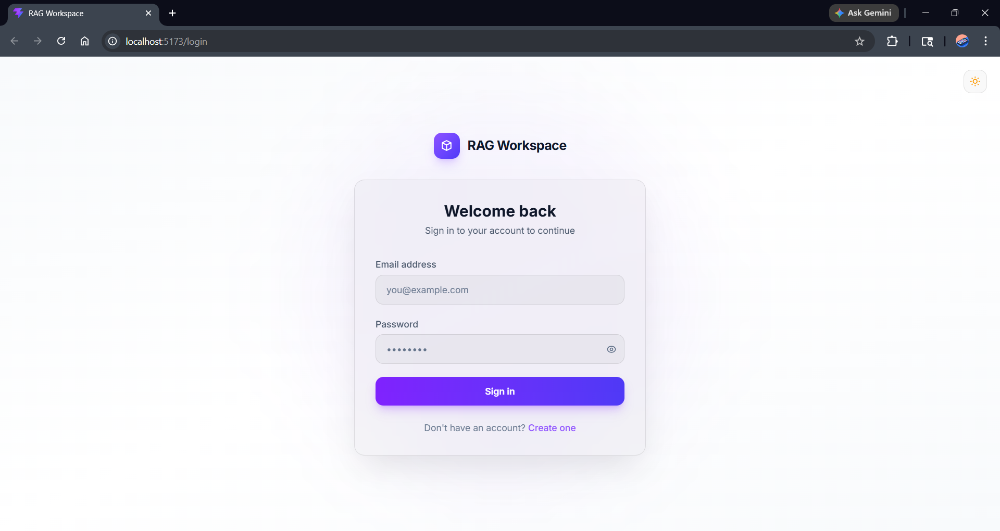
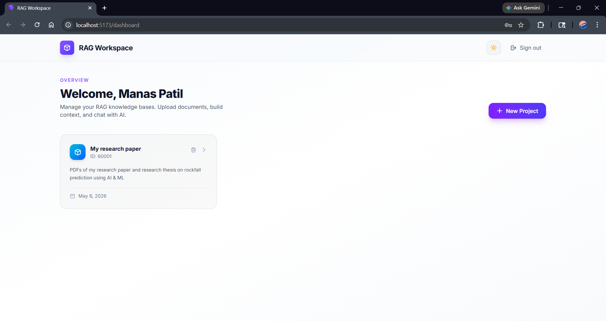
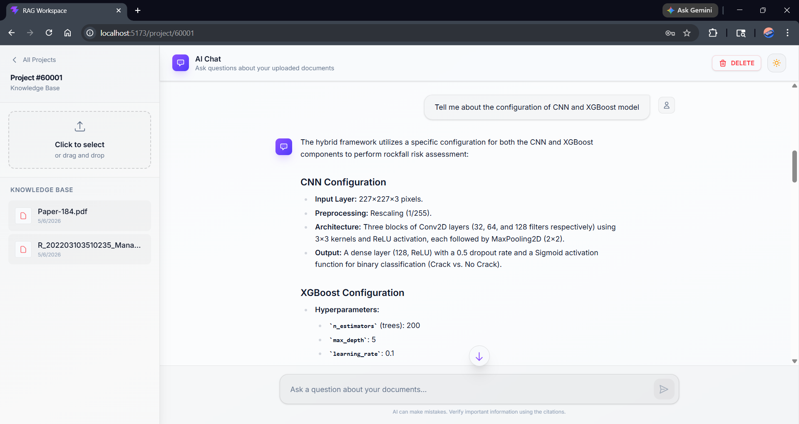
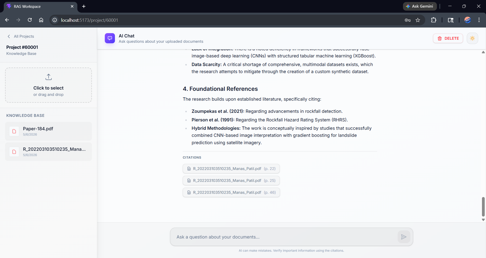
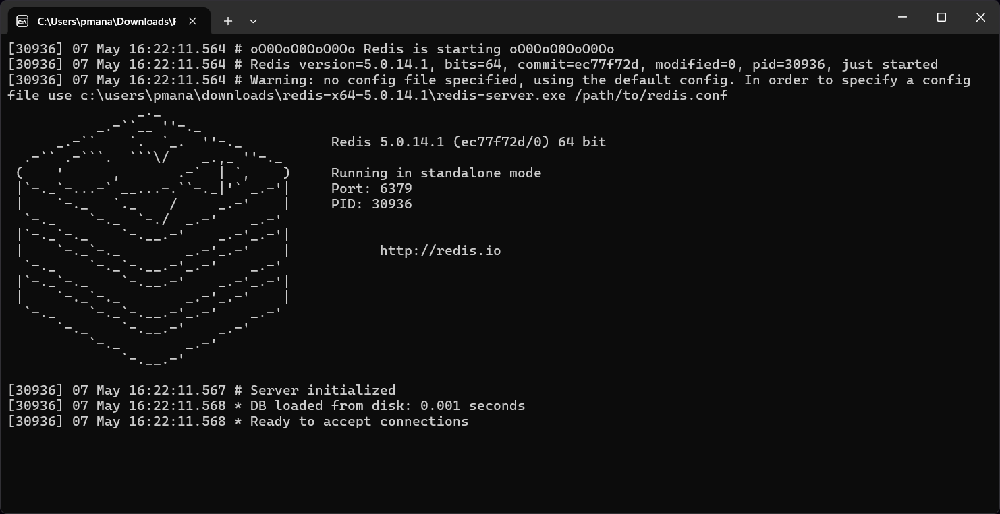

# 🧠 RAG-Chatbot-Engine

A production-grade, full-stack enterprise application that transforms unstructured PDF documents into an interactive, multimodal knowledge base. This project utilizes advanced Retrieval-Augmented Generation (RAG) techniques, an asynchronous background processing architecture, and an interactive React frontend to provide instant, highly accurate, and cited answers to user queries.

## 🌟 Advanced RAG Capabilities

This engine goes far beyond a simple wrapper around a vector database. It implements several state-of-the-art AI architectural patterns:

- **Contextual Query Reformulation:** Before searching the database, the engine uses an LLM to analyze the user's conversational history and reformulates the prompt. This resolves pronouns and contextual references (e.g., turning _"What are its main features?"_ into _"What are the main features of the XYZ architecture?"_), dramatically increasing retrieval accuracy.
- **Hybrid Search with RRF (Reciprocal Rank Fusion):** The retrieval pipeline doesn't just rely on dense vector embeddings. It runs parallel searches using both **Dense Vector Search** (for semantic meaning) and **Sparse Lexical Search** (for exact keyword matching). The results are algorithmically fused using RRF to provide the most mathematically relevant context chunks.
- **Multimodal Summarization Engine:** PDFs aren't just text. During ingestion, the system isolates complex tables and images, dynamically routes them to a multimodal LLM to generate highly descriptive text summaries, and then embeds those summaries alongside the raw text.
- **Asynchronous Processing Pipeline:** Large PDFs can take minutes to process. The backend uses a Redis-backed message broker (RQ) to run the ingestion pipeline in the background, updating a persistent TiDB database with the ingestion status so the React frontend can display real-time polling updates.

---

## 🏗️ Architecture Pipelines

### 1. The RAG Ingestion Pipeline

When a user uploads a PDF, the file is handed off to an isolated RQ Background Worker. The document is partitioned into atomic elements, chunked logically by title, and multimodal elements (images/tables) are summarized by the LLM. Finally, the chunks are embedded and saved into dual storage layers: ChromaDB and a local BM25 index.


### 2. The RAG Retrieval Pipeline

When a user asks a question, the query is reformulated and sent down two distinct paths. The string goes to the BM25 Index, while the embedded vector goes to ChromaDB. The retrieved chunks are fused, scored, and injected into the final LLM prompt alongside the user's original question to generate a cited, factual response.


---

## 🛠️ Tech Stack

- **Frontend:** React.js, Tailwind CSS, Axios
- **Backend:** FastAPI (Python), SQLAlchemy, Pydantic
- **Database:** TiDB (Distributed MySQL-compatible Database)
- **Message Broker & Queue:** Redis, RQ (Redis Queue)
- **AI / RAG Framework:** LangChain, Unstructured.io
- **Vector Database:** ChromaDB

---

## ⚙️ System Configurations

- **Primary LLM Engine:** `gemini-3.1-flash-lite-preview` (Google AI Studio)
- **Embedding Model:** `all-MiniLM-L6-v2` (HuggingFace)
- **Sparse Retrieval Index:** `BM25Okapi` (.pkl local storage)
- **Vector Metric:** Cosine Similarity

---

## 📸 Demo & Screenshots

**🎥 [Click here to watch the full Video Demo](https://drive.google.com/file/d/1rjHLaaRUEgyt7VcF2Pjnb6QL8LuiJ347/view?usp=sharing)**

### Login / Authentication



### User Dashboard



### Project Workspace & Chat





---

## 🚀 Local Setup Instructions

Follow these step-by-step instructions to run the RAG-Chatbot-Engine on your local machine.

### 1. Clone the Repository

```bash
git clone https://github.com/patilmanas04/RAG-Chatbot-Engine.git
cd RAG-Chatbot-Engine
```

### 2. Backend Setup

Navigate to the backend directory and set up your Python virtual environment:

```bash
cd backend
python -m venv venv

# Activate on Windows:
venv\Scripts\activate
# Activate on Mac/Linux:
source venv/bin/activate

# Install dependencies
pip install -r requirements.txt
```

### 3. Environment Variables

Create a `.env` file in the root of the `backend` directory and add the following keys:

```env
TIDB_URL="your_tidb_sql_url"
SECRET_KEY="your_jwt_secret"
ACCESS_TOKEN_EXPIRE_MINUTES=60
HF_TOKEN="your_huggingface_token"
GEMINI_API_KEY="your_gemini_api_key"
```

**Where to get your credentials:**

1.  **TIDB_URL:** Create a free serverless cluster at [TiDB Cloud](https://tidbcloud.com/).
2.  **HF_TOKEN:** Generate an access token at [HuggingFace Settings](https://huggingface.co/settings/tokens).
3.  **GEMINI_API_KEY:** Get your free API key from [Google AI Studio](https://aistudio.google.com/app/apikey).
4.  **SECRET_KEY:** Generate a secure random string (e.g., using `openssl rand -hex 32` in your terminal).

### 4. Start the Redis Server

You must have a Redis server running locally to handle the background queues.

- **For Windows Users (Option A: Direct Native Install):**
  1. Download the pre-compiled Redis for Windows `.zip` file from the [provided GitHub repository](https://github.com/tporadowski/redis/releases). _(Note: Download the `Redis-x64-X.X.X.zip` file)._
  2. Extract the `.zip` file to a permanent folder on your machine.
  3. Open the extracted folder and execute `redis-server.exe` (either by double-clicking it or running it in the terminal).
  4. Keep this terminal window open!

  

- **For Windows Users (Option B: Via WSL):**
  Open your WSL terminal (Ubuntu) and run:

  ```bash
  sudo apt update
  sudo apt install redis-server
  sudo service redis-server start
  ```

- **For Mac/Linux Users:**
  Please refer to the [Official Redis Installation Guide](https://redis.io/docs/latest/operate/oss_and_stack/install/install-stack/).

### 5. Start the FastAPI Server

With your virtual environment activated and Redis running, start the backend API:

```bash
uvicorn main:app --reload
```

### 6. Start the RQ Background Worker

Open a **new terminal window**, navigate to the `backend` directory, activate the virtual environment again, and start the worker to handle PDF ingestion:

```bash
rq worker rag_ingestion --worker-class rq.SimpleWorker
```

_If successful, you will see output similar to this:_

```text
12:38:26 Worker cc457c3d5f084c959f456f32c9b65aea: started with PID 22444, version 2.8.0
12:38:26 Worker cc457c3d5f084c959f456f32c9b65aea: subscribing to channel rq:pubsub:cc457c3d5f084c959f456f32c9b65aea
12:38:26 *** Listening on rag_ingestion...
12:38:26 Worker cc457c3d5f084c959f456f32c9b65aea: cleaning registries for queue: rag_ingestion
```

### 7. Frontend Setup

Open a third terminal window, navigate to the `frontend` directory, and start the React app:

```bash
cd frontend
npm install
npm run dev
```

The full application is now up and running! Navigate to `http://localhost:5173` (or the port provided by Vite) in your browser to start chatting with your documents.

---

## 👨‍💻 Let's Connect

Built by **Manas Patil**.

If you found this project helpful or interesting, I'd really appreciate it if you could drop a ⭐ on the repository!

If you want to discuss the architecture, collaborate, or just talk about tech, feel free to reach out:

- 💼 **LinkedIn:** [linkedin.com/in/patilmanas](https://www.linkedin.com/in/patilmanas/)
- 📧 **Email:** [pmanas13092004@gmail.com](mailto:pmanas13092004@gmail.com)

---
